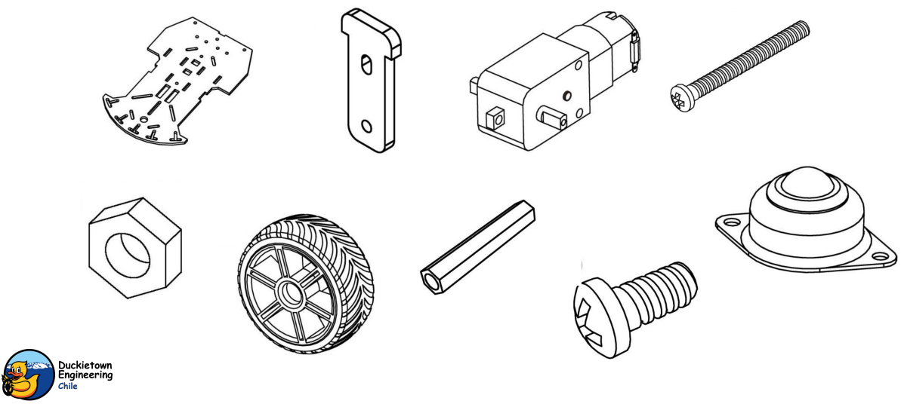

# DuckGPT: Duck-Robot Interaction 🦆🤖
<h3 align="center">
    
</h3>

# Improving quality of life for ducks 🍃

DuckGPT is a project born to make voice-driving cars. Ducks only need to communicate their requests and DuckGPT will execute the corresponding action or answer a questions about any topic since it's powered by ChatGPT 4.0 IA.

## Features ✨

- **Voice Recognition:** The car is equipped with a voice recognition system powered by ```gTTS``` to translate to text the duck requests.

- **ROS integration:** The ```Robot Operating System (ROS)``` is used as the framework for building and controlling the robotic system.

- **State Machines:** The project employs state machines to model the different states of the car, ensuring efficient and modular control.

# gTTS / ChatGPT 4.0 / states machines with ROS / Python 🐍

This voice-driven car project utilizes the Google Text-to-Speech (gTTS) service to convert text commands into spoken words. The processed text is then analyzed and interpreted by ChatGPT 4.0, an advanced language model, to understand user intent and generate corresponding instructions for the robotic system. The voice commands can be expressed in various ways and ChatGPT is designed to understand them flexibly. The 4 states are shown below with corresponding examples:

1. **Dance Command:**

```python
gTTS: "I'd like to see a dance for about 10 seconds."
```

ChatGPT 4.0 intelligently processes the command and sends motor instructions to initiate a dance routine for the specified duration.

2. **Move Forward Command:**

```python
gTTS: "Can you move ahead by around 50 centimeters?"
```

The system's natural language understanding translates the command into motor instructions, directing the car to move forward by the specified distance.

3. **Spin Command:**

```python
gTTS: "How about spinning to the right for roughly 90 degrees?"
```

Motor instructions are generated to spin the car in the specified direction and angle, showcasing the system's flexibility in understanding different ways of expressing commands.

4. **Chat Action:**

```python
gTTS: "Tell me a joke."
```

If the request understand by gTTS doesn't fit in any of the other actions, ChatGPT will answer by the context given.

# Hardware required 🖥️ 

The project was made using the following hardware for the chasis:

<h3 align="center">
    
</h3>

In cooperation with a Raspberry Pi 3 Model B to control the motors that is connected throught a ethernet cable to a Jetson NANO Dev Kit to comunnicate with ChatGPT and gTTS. The last one can be any computer with Ubuntu 22.04 OS, but is recommended a Dev Kit for its size, thus making the robot in no need to link with another external computer via ethernet.

# Prerequisites ✅

Before getting started, ensure you have the following installed:

- ROS Noetic.
- Python 3.x in the Jetson (or in your computer that communicates with gTTS and ChatGPT).
- Python 2.x in the Raspberry Pi.
- SMACH installed in the Jetson to crete and control the machine states.

# Installation 👨‍💻

1. Clone this repository:

```shell
git clone https://github.com/PhillipeJoos/training_pkg.git
```

2. Install dependencies:

```shell
pip install gtts openai roslibpy typer rich
```

# Usage 🔧

Inside the directory ```training_pkg/src/``` you need to create a directory named ```api_key/``` with a single text file ```api_key.txt``` that contains a token for your openai account.

In the Raspberry Pi run ```roslaunch ros_cap duckie_core.launch veh:=duckiebot rect:=true``` to initialize ROS. In the Jetson NANO export ROS_IP and ROS_MASTER to connect the Jetson to ROS in the Raspberry Pi.

To test the robot, first run ```training_pkg/src/instrucciones.py``` in the Raspberry Pi via ssh throught the Jetson NANO, and then in the Jetson NANO execute the file ```training_pkg/src/duck_gpt/gpt_machine.py``` to listen for commands and send the prompts to ChatGPT for further processing.

# Acknowledgments

Special thanks to the Duckietown community for inspiration and support.

# Contact 📲

The team behind DuckGPT is listed below:

- Phillipe Joos (Ingeniere Trainee): phillipe.joos@ug.uchile.cl
- Fernando Muñoz (Ingeniere Trainee): fernando.munoz.o@ug.uchile.cl
- Sebastián Morales (Ingeniere Trainee): sebmorales@ug.uchile.cl
